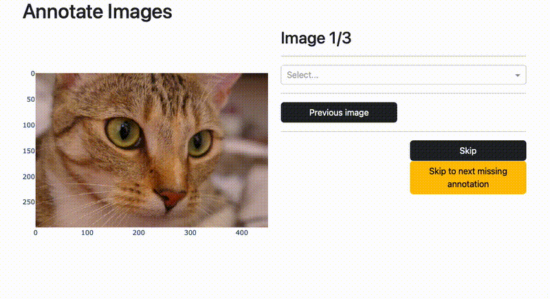

# Dash Annotate CV - A dash library for computer vision annotation tasks

`dash_annotate_cv` is a Python Dash library for computer vision annotation tasks. It exposes reusable annotation components in a library format for `dash`.



Supported tasks:
* Annotation of images (whole image labels)

Roadmap for future tasks:
* Annotating multiple labels per image
* Annotating bounding boxes
* Annotating videos
* Annotating tags

**Note**: this library is not meant for production usage. It is meant to be used for quick prototyping and testing of annotation tasks.

## Getting started

1. (Recommended) Create a new conda environment.

    ```bash
    conda create -n dash_annotate_cv python=3.11
    conda activate dash_annotate_cv
    ```

2. Install requirements.

    ```bash
    pip install -r requirements.txt
    ```

3. Install the library.

    ```bash
    pip install -e .
    ```

4. Run the example.

    ```bash
    cd examples
    python example.py
    ```

## Example

You can also check out the [examples](examples).

```python
from dash import Dash, html
from dash_annotate_cv import AnnotateImageLabelsAIO, ImageSource, LabelSource, AnnotationStorage, ImageAnnotations
import dash_bootstrap_components as dbc
from skimage import data

# Load some images
images = [ ("chelsea",data.chelsea()), ("astronaut",data.astronaut()), ("camera",data.camera()) ]

# Set up the image and label sources
image_source = ImageSource(images=images)
label_source = LabelSource(labels=["astronaut", "camera", "cat"])

# Set up writing
storage = AnnotationStorage(storage_type=AnnotationStorage.Type.JSON, json_file="annotations.json")

app = Dash(__name__, external_stylesheets=[dbc.themes.BOOTSTRAP])
app.layout = dbc.Container([
    html.H1("Annotate Images"),
    AnnotateImageLabelsAIO(label_source, image_source, annotation_storage=storage)
    ])
app.run(debug=True)
```

The result is shown in the gif above.

### Loading the annotations & format

Loading the annotations is as simple as:

```python
with open("annotations.json","r") as f:
    annotations = ImageAnnotations.from_dict(json.load(f))
```

See the `ImageAnnotations` class for more information on the format.

## Dev

[All-in-one components for Dash](https://dash.plotly.com/all-in-one-components)
[Image annotation in Dash](https://dash.plotly.com/annotations)