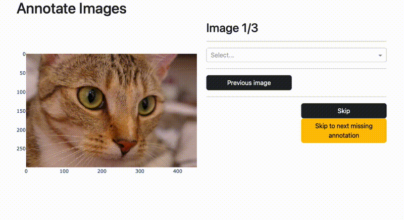
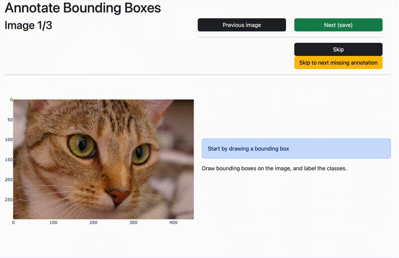

# Dash Annotate CV - A dash library for computer vision annotation tasks

`dash_annotate_cv` is a Python Dash library for computer vision annotation tasks. It exposes reusable annotation components in a library format for `dash`.


*Example of whole-image label annotations*


*Example of bounding box annotations*

Supported tasks:
- [x] Annotation of images (whole image labels)
- [x] Annotating multiple labels per image
- [x] Annotating bounding boxes including labels

Roadmap for future tasks:
- [ ] Support for more annotation formats: YOLO, COCO, etc.
- [ ] Support for image segmentation tasks.
- [ ] Support for skeleton annotation tasks.
- [ ] Annotating video events
- [ ] Annotating video tags

**Note**: this library is not meant for production usage. It is meant to be used for quick prototyping and testing of annotation tasks.

## Getting started

1. (Recommended) Create a new conda environment.

    ```bash
    conda create -n dash_annotate_cv python=3.11
    conda activate dash_annotate_cv
    ```

2. Install using pip:

    ```bash
    pip install dash_annotate_cv
    ```

    Or local install from the repository:

    ```bash
    git clone https://github.com/smrfeld/dash-annotate-cv 
    cd dash-annotate-cv
    pip install -e .
    ```

3. Run the example as described next.

## Examples

The app can be launched in two ways:
1. A simple command line utility lets you get up and running quickly.
2. The app can be launched by writing a short Python script, which lets you use the annotation components in a flexible way in your own Dash app. We follow the practices of resuable components in Dash described in [All-in-one components for Dash](https://dash.plotly.com/all-in-one-components).

Each is described here briefly. You can also check out the [examples](examples).

### Command line utility

To get started labeling immediately, you can use a simple command line utility. You just need to write a config YAML file. You can see the [examples](examples) directory for more examples - as simple example is as follows:

```yaml
# Annotation mode
# image_labels = Annotate images with whole-image labels
# bboxs = Annotate bounding boxes in each image
mode: image_labels

# Label source
label_source:
  labels:
  - astronaut
  - camera
  - cat

# Image source
image_source:

  # Image source type
  source_type: list_of_files

  # List of files
  list_of_files:
  - ex_chelsea.jpg
  - ex_astronaut.jpg
  - ex_camera.jpg

# Storage (optional)
storage:
  storage_type: json
  json_file: example.json

# Options (optional)
options:

  # How many labels can be selected per image
  selection_mode: single
```

To launch the app, simply run:

```bash
dacv conf.yml
```

Navigate to the default address `http://127.0.0.1:8050/` in your browser to use the app.

Use `dacv -h` for a complete list of options. Or check out the [examples](examples) directory for more examples.

### Python

You can use the library in your own Dash app. This is recommended as a more flexible way to create your own annotation interface. The following example shows how to use the library to annotate images with labels.

```python
# Import the library
import dash_annotate_cv as dac

# Other imports
from dash import Dash, html
import dash_bootstrap_components as dbc
from skimage import data

# Load some images
images = [ ("chelsea",data.chelsea()), ("astronaut",data.astronaut()), ("camera",data.camera()) ]

# Set up the image and label sources
image_source = dac.ImageSource(images=images)
label_source = dac.LabelSource(labels=["astronaut", "camera", "cat"])

# Set up writing
storage = dac.AnnotationStorage(storage_types=[dac.StorageType.JSON], json_file="annotations.json")

app = Dash(__name__, external_stylesheets=[dbc.themes.BOOTSTRAP])
app.layout = dbc.Container([
    html.H1("Annotate Images"),
    dac.AnnotateImageLabelsAIO(label_source, image_source, annotation_storage=storage)
    ])
app.run(debug=True)
```

The result is shown in the gif above. Check out the [examples](examples) directory for more examples.

### Loading the annotations & format

Loading the annotations is as simple as:

```python
with open("annotations.json","r") as f:
    annotations = dac.ImageAnnotations.from_dict(json.load(f))
```

See the `ImageAnnotations` class for more information on the format.

## Dev

Some useful references:

* [All-in-one components for Dash](https://dash.plotly.com/all-in-one-components)
* [Image annotation in Dash](https://dash.plotly.com/annotations)